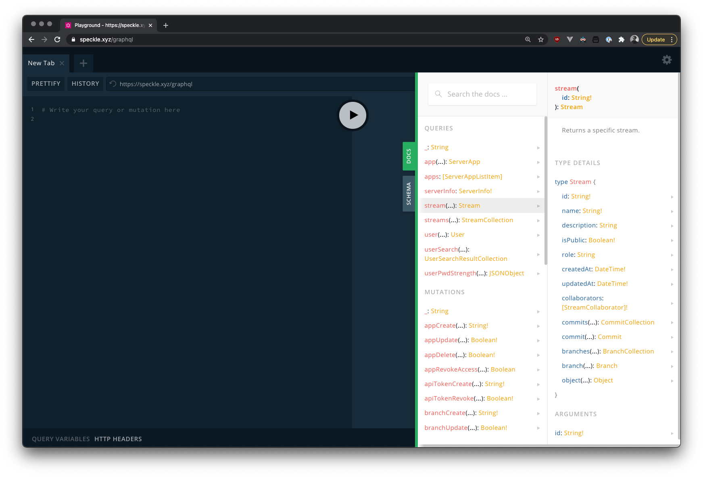

# GraphQL API

Our Speckle Server offers both a GraphQL API and a [REST API](/dev/server-rest-api), for most of your queries the GQL API is probably best suited because of its flexibility and ease of use.
When working with uploading and downloading objects, the REST API is preferred.

## GraphQL Explorer

The best way to explore and understand the Server API is to use our interactive explorer that comes bundled with the server.

:::warning

Any queries and mutations that you execute through the explorer will use the actual data from the server - take care!

:::

Simply head to `CANONICAL_URL/explorer` or to [https://speckle.xyz/explorer](https://speckle.xyz/explorer), and on the right panel you'll be able to see the API docs and schemas. After logging in you'll also be able to execute queries and mutations as the logged in user.


### Classic GraphQL Explorer

Alternatively, the classic GraphQL explorer is also available at `CANONICAL_URL/graphql` or [https://speckle.xyz/graphql](https://speckle.xyz/graphql).



To authenticate, you will need to pass in a personal access token in the authorization header:


:::tip

How do you create a token, we hear you ask? Read the section on [personal access tokens](/dev/tokens.html)!

:::

### Advanced queries

Our GQL API also lets you run advanced queries, for instance you can use it to query Revit parameter data. See the examples below.

#### Example 1

When trying to query Revit parameters (family, category, etc.) for a specific object (0d0a4...), in a specific stream (c6b0c...) :

```graphql
query($myQuery:[JSONObject!]){
    stream(id:"c6b0c4077a"){
        object(id:"0d0a4abc6a5fcc763e6c850dd3d5ecab"){
            totalChildrenCount
            children(query: $myQuery select:["parameters", "speckle_type", "type", "family", "category"]){
                totalCount
                cursor
                objects{
                    id
                    data
                }
            }
        }
    }
}
```

Where the "myQuery" variable is:

```json
{
    "myQuery": [
        {
            "field":"applicationId",
            "value":"6cbabf1d-e8d0-47f0-ac4d-9a7923128d37-0006fb07",
            "operator":"="
        }
    ]
}
```

#### Example 2

Return objects while querying by a specific parameter value. Here, only objects with a parameter value greater than 5 are returned.

```graphql
query($myQuery:[JSONObject!]){
    stream(id:"c6b0c4077a"){
        object(id:"0d0a4abc6a5fcc763e6c850dd3d5ecab"){
            totalChildrenCount
            children(query: $myQuery select:["parameters[0]".value, "parameters[0].name"]){
                totalCount
                cursor
                objects{
                    id
                    data
                }
            }
        }
    }
}
```

Where the "myQuery" variable is:

```json
{
    "myQuery": [
        {
            "field":"parameters[0].value",
            "value":5,
            "operator":"<"
        }
    ]
}
```
