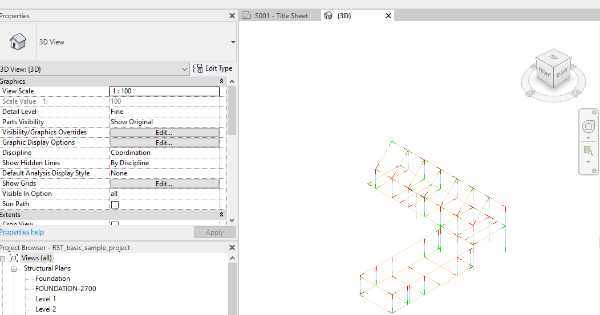

# ETABS (Alpha) 🛠️

The Speckle ETABS Connector currently supports ETABS v18 and v19. It is currently under alpha development so please report any bugs or feedback to the [community forum](https://speckle.community/). 

::: tip

Check out our dedicated tutorial on [how to get started with etabs](https://speckle.systems/tutorials/getting-started-with-speckle-for-etabs/)!

:::

## Getting Started

To install the ETABS Connector and add your Speckle account, proceed by following the instructions in [Speckle Manager](/user/manager).

Once installed, you can find the ETABS connector in the PlugIn menu under the **Tools** tab like so:

 

### Recieving in ETABS
Save the ETABS model as a file first before attempting to recieve streams into your ETABS model. 

## User Interface
::: tip IMPORTANT 🙌

This connector uses our shared Desktop UI2. Read up on general guidelines for usage in the [Desktop UI2 section](https://speckle.community/t/new-desktopui-in-alpha-testing/1851/2).

**Streams are saved to a textfile that will appear in your model folder titled "Speckle". Do not delete this folder.**

:::

### Selection Filters

To help you select which elements will be to sent to Speckle, we've built various filters into our ETABS connector. Once a filter is set, just click **Send** and all objects passing the filter will be sent to your Stream. Section properties and materials defined within the model will always be sent. 

_Please Note: Elements are sent regardless of whether they are visible or if they were created after setting up the filter._

#### Category Filter

The category filter lets you select one or more of the currently-supported ETABS categories.

#### All Filter

This trivial filter allows you to select all the elements that are currently supported by the ETABS connector. 

## Supported Elements

- [ETABS Support Tables](/user/support-tables.html#etabs)

## Updating Elements

The connector does not take care of updating existing elements within the stream. However ETABS does recognize if concident elements are generated and will not generate new elements that concident ontop of each other.

## Revit & BIM Data to ETABS

When sending from elements from Revit, Speckle takes care of converting the data to a Speckle friendly format. If you're curious about how this data is being structured, please have a look at our [Objects Kit class definitions](https://github.com/specklesystems/speckle-sharp/tree/master/Objects/Objects/BuiltElements).

To send elements from Revit specficially into a structural model, use the analytical models generated within a revit model.Currently there is no conversion from the BuiltElement object kits and the Structural object kits. Which means that only the analytical models in Revit are supported to be converted into ETABS. Give us feedback on this workflow. 

## Grasshopper to ETABS
The schema for the structural objects is based around our structural pyramid of objects. Refer to the [discourse post](https://speckle.community/t/introducing-structural-classes-for-speckle/1824/8) here if you haven't for all the information about this kit. There are ETABS application specific grasshopper components. Check them out and use them to build specific properties like deck sections. If there is no specific ETABS component, use the general structural schema to define them. 

Everything is encapsulated in the model object from the schema in the end. Therefore make sure you define the model object. 

::: Tip

It's worth building an ETABS model and sending and recieving that object in ETABS before you attempting building a model from grasshopper directly. 

:::

Building models parametrically in grasshopper with the structural object schema is supported with ETABS. To build section profiles from catalogue and have material definitions imported into the ETABS from scratch, you will have to match the spelling of the catalogue directly as if you were importing it.  Look below for an example of the spelling used.

## Exploring the ETABS data

To easily explore on object's data and parameters, our [Speckle Web App](/user/web.html) interface can be of great help. As well as any other applications that lets you explore the object metadata (eg Grasshopper, Dynamo, Unity, etc).

