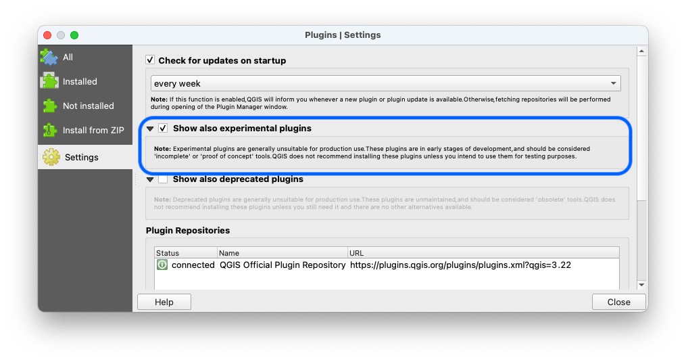
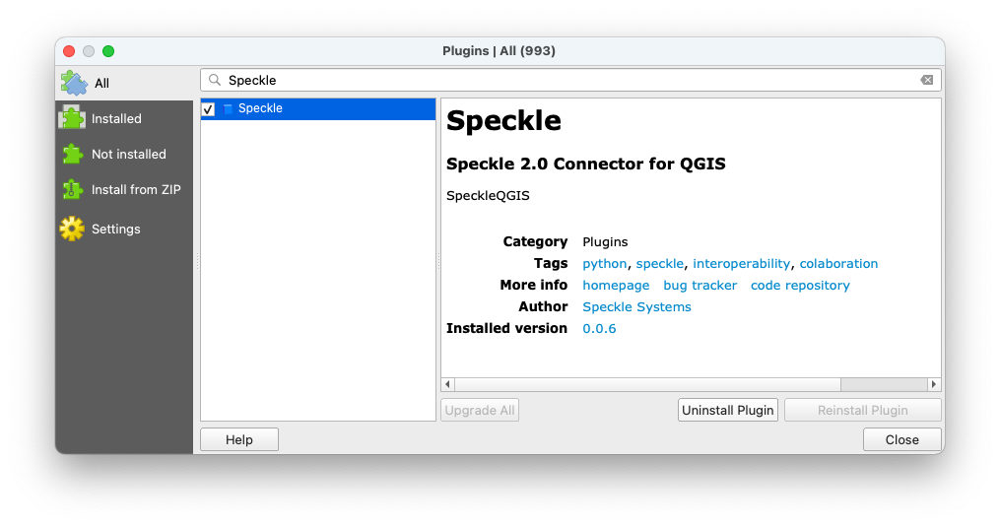
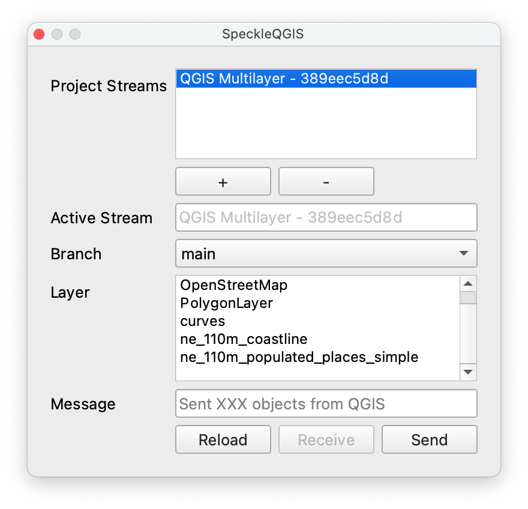

# QGIS

::: tip

The QGIS conector is in early stages of development and it is released as _experimental_.
:::

The Speckle 2.0 conector for QGIS currently supports QGIS versions 3.0.0 and upwards.

## Getting started

### Installation

You can find Speckle QGIS in the QGIS `Plugins -> Manage and install plugins` menu item.

The plugin is currently published as experimental, so make sure you go to `Settings` and activate the `Show also experimental plugins` checkbox.

Then go to the `All` tab and search for `Speckle`. You should see the plugin appear in the list:

> You can also install it manually by either using the `Install from zip` option, or following the manual installation instructions in our [repo's readme](https://github.com/specklesystems/speckle-qgis).
>
> 

### Features

The plugin allows you to select several layers in your project, and send their geometry (as well as their contained metadata), to a Speckle server.

Only vector based layers are supported. We're looking to improve support for other types of layers in the future.

> Unsupported items
>
> - Raster layers
> - OSM layers

### Using Speckle QGIS

Once the plugin is installed, you'll find a new toolbar button in QGIS that will open the `SpeckleQGIS` panel.

The panel contains a very simple UI interface:

#### Sending data

In order to send some data, just follow these steps:

1. Select an account
2. Specify a specific stream to send data to. This can be done either by introducing it's ID or its full `stream url` from Speckle.
3. Select the layers in the file that you wish to send.
4. Send the selected layers.

Here's a quick walkthrough of the process.

#### Receiving data

For now, we've concentrated our efforts in extracting data **from** QGIS, but soon you'll also be able to receive data into QGIS.

If receiving data into QGIS is a feature you _**cannot live without**_, join the conversation on our [Community forum](https://link) and help us shape it with your feedback!

## Feedback

We're really interested in your feedback regarding the integration between QGIS and Speckle! You can always reach us at
