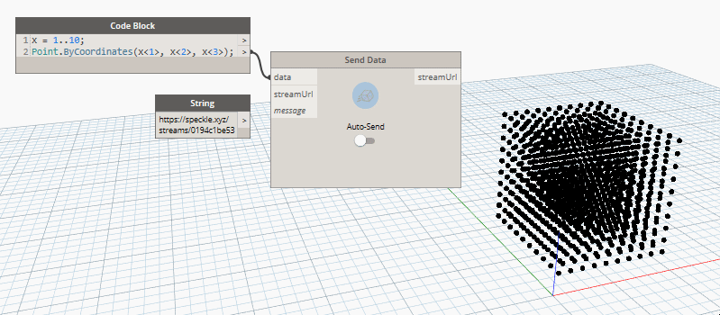

# Zero to Speckle ASAP

Pressed for time? Here's a lightning-fast intro to getting started!

## Registration

Before you can use Speckle, you'll need an account!

- You can register on our [free official XYZ Server](https://speckle.xyz/))
- Otherwise, If your company runs its own Speckle server, you can register using the URL they provided

As you register, a friendly onboarding wizard will take you through some set-up steps.

## Creating your first stream

Congratulations 🥳! You now have a Speckle account and have logged in, what you are seeing is the Speckle [web app](/user/web).

From here, you can view and manage data and 3D models you have sent to Speckle or that others have shared with you.

**Let's now create your first stream:** to do so click on the big blue button that says "New Stream".

:::tip 💡 What's a Stream

**Streams** are collections of data inside Speckle. You can see a stream as a folder, a project or a repository.

Data in a stream is stored in **commits**, which are snapshots of data in time. Every time you send to Speckle from a connector, a commit is created.

Commits can also be organized in **branches**, for instance, to have multiple design options or to store data by discipline. The default branch is called main.

:::

## Sending and Receiving data with Connectors

New Streams are always empty, in order to get data into them we'll need to use one of the many Speckle connectors

:::tip 💡 What are Connectors

**Connectors** are plugins for design and analysis software, they let you exchange geometry and BIM data directly from the tools you use.

Install our connectors and you'll instantly be able to **share your models and data** with others or **access it from the web**, or **load it into other supported software**.

:::

You can explore each of our connectors in detail in their docs section: [Connectors](/user/connectors).

### Installation

Unless otherwise stated, Connectors are installed from a standalone desktop app called [Speckle Manager](/user/manager).

- [⬇️ Download Speckle Manager](https://releases.speckle.systems)

Manager will also notify you when new versions are available, so you never miss out on the good stuff!

:::tip ⚠️ Important

In order to use use our connector, you also need to log into your Speckle account using Manager. A wizard will guide you through that process when you install Manager or as well from our web app if needed.

:::

### Grasshopper and Dynamo

The connectors for [Grasshopper](/user/grasshopper) and [Dynamo](/user/dynamo) are fairly aligned. The most important components/nodes are `Send Data` and `Receive Data`. These connectors will use the default account you've set in Speckle Manager, though this can be overridden using the relevant `Account` components/nodes.

You also get components/nodes to `Create`, `Get`, `Update`, and `Delete` streams as well as get a `List` of your streams or more `Details` for a stream. Streams can be retrieved by either using the `List` component or the URL of a specific stream, branch, commit or object.

Finally, there are some more advanced components/nodes for creating and expanding custom objects, for JSON serialisation, and local sending / receiving.

### Revit, Rhino, AutoCAD, Civil3D, Bentley etc

Most other Connectors share the same user interface, you can read more about it [in its own section](/user/ui2).

From it, you can select a Stream you have previously created and decide whether to send or receive data from it. Pretty simple huh?!
In case you were wondering what data exchanges are allowed between all the various supported software, we have created a series of [Supported Elements tables](/user/support-tables) that will help you.

## Seeing your models online

After you've sent something to Speckle (aka you created a commit, using Speckle's lingo) you'll be able to see it in our 3D viewer and embed it into almost any other web page.
Just head to that stream in our web app to do so!

Here's a sample one we have created for you: [https://speckle.xyz/streams/3073b96e86](https://speckle.xyz/streams/3073b96e86)

Once your data is on Speckle, there's of course much more you can do like:

- managing permissions
- sharing it with others
- exploring it in our UI and 3D viewer
- accessing it programmatically via API
- consuming it via other Speckle apps
- receive it into other software
- add comments and issues (coming soon!)
- much more!

## Conclusion

That's all, folks! You are now successfully set up and have the tools to start using Speckle. If you need further guidance on anything we covered here, head over to the more detailed sections below. If you want to learn more about the code side of things, the [Dev Docs](/dev/) should be your next stop.

If you'd like more detailed guides for sending data between AEC software, check out our [tutorials](https://speckle.systems/tutorials/).

If you're enjoying Speckle, have any questions, or would like to share any feedback or suggestions, please drop by our [Community Forum](https://speckle.community/) and join the conversation.
